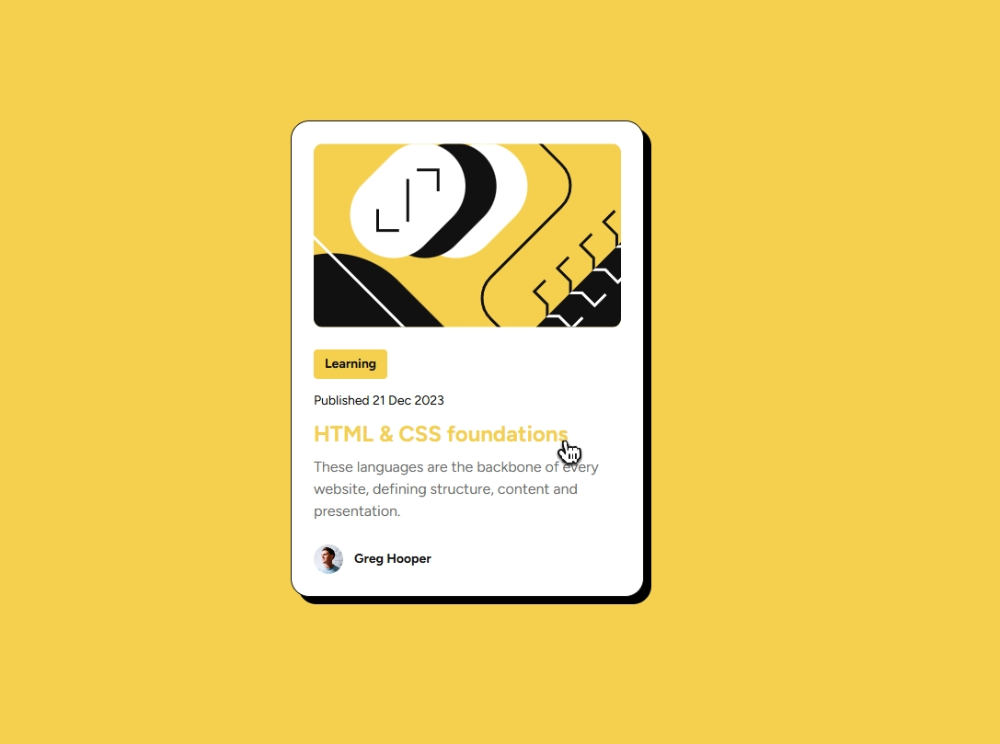
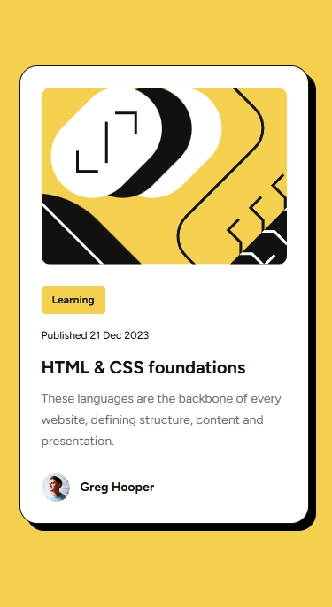

# Blog preview card solution | Frontend Mentor

This is a solution to the [Blog preview card challenge on Frontend Mentor]
Frontend Mentor challenges help you improve your coding skills by building realistic projects.  

---

## 📸 Screenshots

### Desktop


### Mobile


---

## 🔗 Links

- Solution URL: [Frontend Mentor Solution](https://www.frontendmentor.io/solutions/blog-preview-card-with-hover-effects-and-mobile-first-css-f8TU6SVDfC)
- Live Site URL: [Live Demo](https://artkozyr.github.io/blog-preview-card/)

---

## 💻 Built with

- Semantic **HTML5**
- **CSS3** custom properties
- **Flexbox** layout
- Mobile-first workflow
- Responsive typography & hover states

---

## 📚 What I learned

This project helped me practice building a reusable card component with semantic HTML and modern CSS.  
I reinforced my skills with:

- Flexbox for vertical and horizontal alignment
- Responsive units (`rem`, `%`) and media queries
- Hover states for links and buttons
- Custom cursor icon implementation  

```css
.btn:hover {
  cursor: url(./images/pointer-icon.png) 12 3, auto;
}
